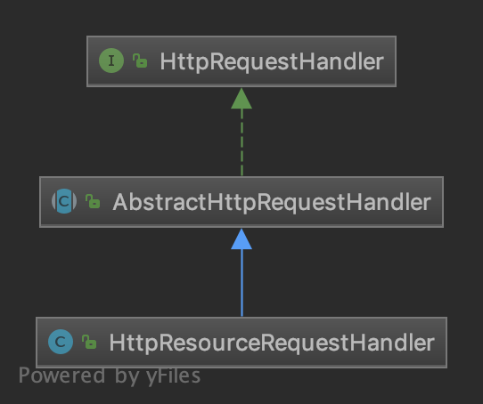

## 참고자료

https://github.com/woowacourse/jwp-was/tree/SEOKHYOENCHOI

### 코드분석

- Socket을 이용한 HTTP Web Server

  1. 요청을 처리하기 위한 Thread를 100개 생성한다.

  2. 요청이 들어오면, 처리를 위한 RequestHandler를 생성한다.

  3. (선택) netty

  

- RequestHandler

  1. HandlerMapping의 getHandler(String path) 메소드로 적절한 HandlerMapping을 찾는다.
     - getHandler는 각 HttpServletRequestHandler, HttpResourceRequestHandler내부의 canHandle을 호출하여 찾는다.

  

  2. handler 메소드를 실행한다.
     - AbstractHttpRequestHandler에 구현되어 있다.
       - 위 클래스에서 handler메소드는 handleInternal 메소드를 호출하는데, 이 메소드는 HttpServletRequestHandler, HttpResourceRequestHandler에 모두 구현 되어 있다.
       - handleInternal 메소드가 실제로 Controller의 메소드를 실행하는 메소드

  3. 응답을 만들어 보낸다.